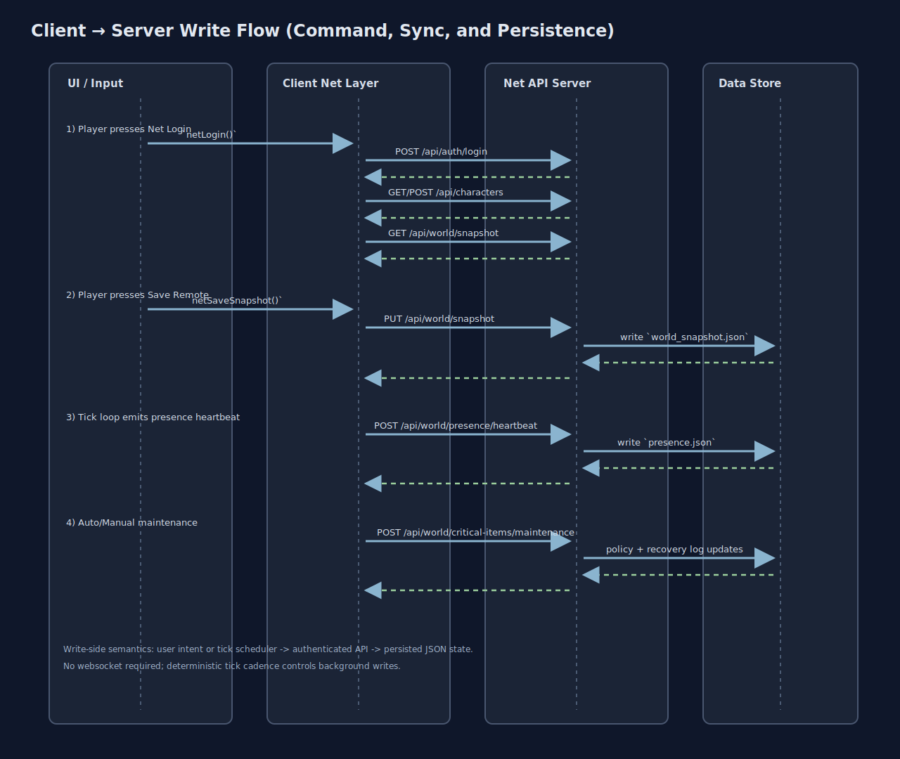
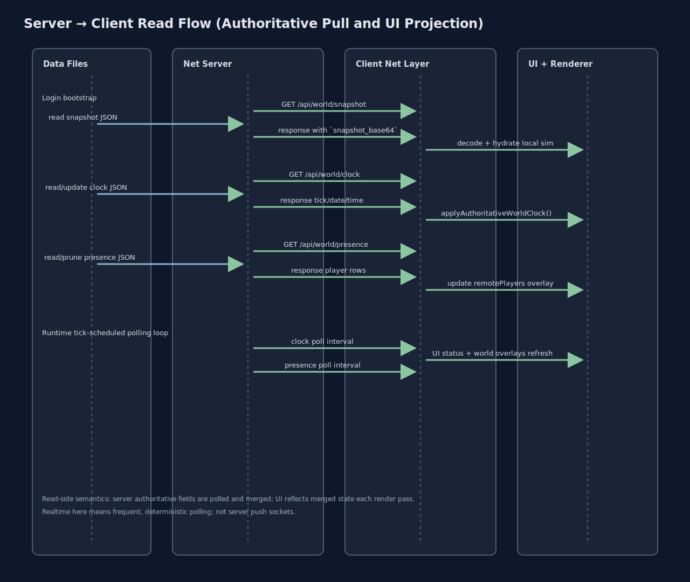

# API/UI Realtime Sync and Flow

This chapter explains how UI actions, simulation ticks, and server authority are wired together in VirtueMachine today.

It answers four practical questions:

1. Which side owns what truth?
2. How does client state move to server state?
3. How does server state move back into the UI in real time?
4. Where can latency, drift, or stale data appear?

## System Topology

### Ownership Boundaries

- Client owns immediate gameplay responsiveness and local render pipeline.
- Server owns shared-presence truth and authoritative world clock.
- Server stores persistent world snapshot payloads (`snapshot_base64`) and metadata (`saved_tick`, hash).
- Client reconciles with server on login and periodic sync loops.

## Client to Server Write Paths

### Interactive writes (user-driven)

- `Net Login` triggers `netLogin()`.
- `Save Remote` triggers `netSaveSnapshot()` -> `PUT /api/world/snapshot`.
- `Load Remote` triggers `netLoadSnapshot()` -> `GET /api/world/snapshot`.
- `Run Maintenance` triggers `netRunCriticalMaintenance()` -> `POST /api/world/critical-items/maintenance`.

### Background writes (tick-driven)

Inside `tickLoop()`:

- Presence heartbeat every `NET_PRESENCE_HEARTBEAT_TICKS` via `netSendPresenceHeartbeat()`.
- Automatic maintenance when enabled every 120 ticks.

This means UI movement in Avatar mode is reflected to server presence without waiting for a manual save.

## Server to Client Read Paths

### On login

`netLogin()` performs initial pull sequence:

1. `POST /api/auth/login`
2. `GET /api/characters` (or create via `POST /api/characters`)
3. `GET /api/world/snapshot` (resume local sim if available)
4. `GET /api/world/clock` (authoritative tick/time)
5. `GET /api/world/presence` (other active players)

### During runtime

`tickLoop()` polls periodically:

- `netPollWorldClock()` updates `state.sim.tick` and calendar/time fields from server.
- `netPollPresence()` updates `state.net.remotePlayers` for remote avatar overlays.

No websocket is currently used. Realtime is implemented as deterministic tick-scheduled polling + heartbeat.

## Realtime Cadence Model

- Local simulation advances every client tick (`TICK_MS` loop).
- Network sync operations are scheduled by tick deltas, not wall-time timers.
- Server world clock advances with `SERVER_TICK_MS` and persists every request path that touches it.
- Presence rows expire via TTL pruning (`PRESENCE_TTL_MS`) to prevent ghost sessions.

This model keeps behavior deterministic and easy to reason about in logs, at the cost of mild polling latency.

## API Contract Surface Used by UI

### Auth and identity

- `POST /api/auth/login`
- `POST /api/auth/set-email`
- `POST /api/auth/send-email-verification`
- `POST /api/auth/verify-email`
- `POST /api/auth/change-password`
- `GET /api/auth/recover-password`

### Character and persistence

- `GET /api/characters`
- `POST /api/characters`
- `GET /api/world/snapshot`
- `PUT /api/world/snapshot`

### Shared world state

- `GET /api/world/clock`
- `GET /api/world/presence`
- `POST /api/world/presence/heartbeat`
- `POST /api/world/presence/leave`
- `POST /api/world/critical-items/maintenance`

## Why It Works This Way

### Why polling instead of sockets

- Tick-aligned polling matches existing deterministic replay/debug workflow.
- Easier to inspect and reproduce from parity snapshots and logs.
- Fewer moving parts during canonical fidelity work.

### Why server clock authority

- Prevents client drift from changing shared temporal semantics.
- Makes multiplayer state comparison stable across clients.

### Why snapshot base64 payloads

- Fastest path to lossless round-trip of full sim state.
- Keeps server persistence format simple while gameplay semantics are still converging.

## Failure Modes and Their UI Symptoms

### Expired token (`401`)

- Client clears token/user/session fields.
- UI transitions to signed-out status and disables authenticated sync behavior.

### Background sync failure streak

- Client increments failure counters and can pause background sync.
- UI shows offline/degraded status while local play can continue.

### Presence TTL expiry

- Remote player disappears from `remotePlayers` until next heartbeat.
- Usually seen as short-lived pop-out when network hiccups.

### Clock poll delay

- Local temporal display may lag briefly, then snap to authoritative values on poll.

## Canonical Gap Notes

Current model is robust but not final-canonical in all respects:

- Realtime channel is polling-based, not event-push.
- World snapshot is whole-state serialization, not semantic object/event replication.
- Conflict-resolution policy between concurrent clients is still intentionally conservative.

These are architecture choices, not visual hacks. They are documented so future canonicalization can replace mechanisms without changing gameplay semantics.

## Source Anchors

- Client sync orchestration: `modern/client-web/app.js` (`netLogin`, `netRequest`, `netPollWorldClock`, `netPollPresence`, `tickLoop`)
- Server API handlers: `modern/net/server.js`
- Contract schemas: `modern/net/contracts/*.json`
- Persistence payloads: `modern/net/data/*.json`
